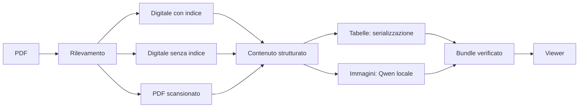

# Industrial Manual Ingestion

[English](README.md) · **Italiano**

Trasforma PDF tecnici in contenuto strutturato e tracciabile, con descrizioni delle immagini generate in locale.

**[Apri il viewer](https://CometaSensitiva.github.io/industrial-manual-ingestion/?lang=it)** · [Formato del bundle](docs/bundle-format.md) (in inglese)

<picture>
  <source media="(prefers-color-scheme: dark)" srcset="docs/viewer-dark.png">
  
</picture>

Una CLI Python elabora il documento. Un viewer web in sola lettura collega ogni record estratto alla sua pagina e alla sua immagine originali. Le tabelle usano una serializzazione strutturata; le immagini ricevono una descrizione da un modello Qwen locale. Non sono inclusi servizi di chat né sistemi di retrieval.

## Per iniziare

Serve **Python 3.12**. Da un terminale, entra nella cartella in cui hai clonato o scaricato il progetto. Se hai mantenuto il nome suggerito, il comando è:

```sh
cd /percorso/di/industrial-manual-ingestion
```

Sostituisci `/percorso/di` con la cartella che la contiene. Su macOS puoi scrivere `cd `, poi trascinare la cartella `industrial-manual-ingestion` nel terminale per inserirne il percorso esatto.

Alla prima installazione, crea l'ambiente e installa la CLI con il parser per i PDF digitali:

```sh
python3.12 -m venv .venv
source .venv/bin/activate
pip install '.[docling]'
```

Le volte successive, entra nella cartella del progetto, attiva l'ambiente esistente e apri la schermata iniziale:

```sh
cd /percorso/di/industrial-manual-ingestion
source .venv/bin/activate
manual-ingestion
```


Il modo più rapido per elaborare un tuo PDF è `manual-ingestion start`: fa quattro domande ed esegue tutto (vedi [CLI](#cli)). La schermata iniziale elenca anche tutti i comandi, con esempi completi da copiare. Per provare passo passo l'esempio pubblico incluso:

```sh
manual-ingestion detect examples/synthetic-manual.pdf
manual-ingestion ingest examples/synthetic-manual.pdf --out my-first-bundle --no-enrich --page-previews
manual-ingestion validate my-first-bundle
manual-ingestion validate examples/synthetic-bundle
```

Il primo bundle viene creato di proposito senza Qwen, così puoi provare subito l'intero flusso; per questo il suo stato è `experimental`. La cartella di output non deve esistere già.

Per descrivere le immagini, avvia **Ollama** (qualsiasi versione: si aggiorna da solo) con il modello **qwen3.5:4b**. Digest del modello, versione del prompt e parametri di generazione sono fissati per rendere l'output riproducibile; la versione esatta di Ollama viene registrata in ogni bundle per tracciabilità.

```sh
ollama pull qwen3.5:4b
manual-ingestion ingest examples/synthetic-manual.pdf --out runs/my-manual --page-previews
```

La prima elaborazione scarica i pesi dei modelli di Docling. Le descrizioni vengono generate in locale. Installazione e download dei modelli richiedono la rete; i documenti vengono inviati solo all'endpoint Ollama configurato (localhost per impostazione predefinita).

## CLI

Il modo più semplice per iniziare è l'elaborazione guidata. Fa quattro domande (il PDF, dove salvare il bundle, se descrivere le immagini, se aggiungere le anteprime delle pagine), accetta un percorso trascinato nel terminale, propone un nome di cartella libero, controlla che Ollama e il modello siano pronti e mostra il comando equivalente prima di partire:

```sh
manual-ingestion start
```

Lo stesso lavoro con i comandi diretti:

```sh
manual-ingestion detect manual.pdf
manual-ingestion ingest manual.pdf --out runs/manual --language it --page-previews
manual-ingestion validate runs/manual
manual-ingestion detect manual.pdf --json
manual-ingestion validate runs/manual --verbose
manual-ingestion schema manual
```

L'interfaccia e l'aiuto della CLI sono in inglese. `--language` registra la lingua del documento (`--language it` per un manuale in italiano); il prompt per le didascalie tecniche richiede campi in italiano, quindi le descrizioni di Qwen possono essere in italiano.

- **Orientarsi:** `manual-ingestion` da solo (o `--help`) apre la schermata iniziale con tutti i comandi. `manual-ingestion help ingest` apre la guida di un singolo comando, e un comando scritto male suggerisce quello più simile.
- **Dopo ogni comando:** l'output leggibile termina con una sezione **Next** che contiene i comandi successivi, già compilati con i tuoi percorsi.
- **Quando qualcosa va storto:** gli errori più comuni (file mancante, tipo di file sbagliato, cartella di output già esistente, cartella che non è un bundle, Ollama spento o modello mancante) spiegano cosa provare.
- **Aspetto:** l'output condivide l'identità del viewer: un ritratto ASCII in due toni (lavanda per l'identità, cobalto per comandi e percorsi), un solo stile di separatori, i marcatori di stato `[ok]`/`[!]`/`[!!]` e un albero dei risultati. Il ritratto viene omesso sotto le 100 colonne e quando l'output è reindirizzato.
- **Effetto di scrittura:** in un terminale interattivo la schermata iniziale si scrive da sola con un ritmo variabile, umano (qualche secondo). Premi un tasto qualsiasi per mostrarla subito, oppure imposta `MANUAL_INGESTION_NO_ANIMATION=1` per disattivarlo. Pipe, CI e `--json` non sono mai animati.
- **Script:** `--json` (su `detect`, `ingest`, `validate`) produce su stdout un output leggibile dalle macchine, senza decorazioni, e gli errori restano righe semplici `manual-ingestion: error: …` su stderr. Avanzamento e log delle librerie vanno su stderr. `--verbose` aggiunge dettagli.

`--page-previews` aggiunge le immagini PNG delle pagine intere per il viewer. `--pages 1-3,5` elabora un sottoinsieme diagnostico di pagine. `--no-enrich` salta la descrizione delle immagini. Queste ultime due opzioni producono un bundle sperimentale. La destinazione non deve esistere già. `--write-failure-report` salva un report accanto alla destinazione in caso di errore.

I PDF scansionati usano un runtime PaddleOCR-VL isolato, configurato con `--paddle-python` e `--paddle-cache`. Vedi i [dettagli del runtime](docs/bundle-format.md#scanned-documents). Per impostazione predefinita l'output da scansione resta sperimentale: questa versione non dichiara un'accettazione generale basata su uno studio di documenti privati.

## Viewer

Il viewer pubblico apre automaticamente un esempio sintetico. Usa **Apri bundle** per scegliere una cartella locale o inserire un URL HTTP(S). Le cartelle locali vengono lette nel browser e non vengono caricate online. Un server remoto deve consentire letture cross-origin.

- **Panoramica:** l'elaborazione in tre passaggi (PDF originale, struttura, descrizioni delle immagini) con anteprime reali, e un terminale che digita il comando `manual-ingestion ingest` esatto che riproduce l'elaborazione, seguito dal suo albero dei risultati. Le elaborazioni senza descrizioni sono indicate in modo esplicito.
- **Ispeziona:** indice del documento, pagina originale con i riquadri degli elementi (le etichette compaiono al passaggio del mouse e per il record selezionato) e contenuto estratto del record selezionato. Sul telefono l'indice si apre come un pannello da una barra compatta con i comandi precedente/successivo, così la pagina resta sempre visibile.
- **Verifiche:** l'esito con una cella per ogni verifica; le verifiche raggruppate in quattro aree (file del bundle, struttura del documento, immagini e tabelle, stato) con gli errori in cima; l'output di `manual-ingestion validate` e la configurazione dell'elaborazione (parser, modello, prompt, versione di Ollama); cosa è stato misurato, i segnali del percorso e i file del bundle. Un riquadro a parte spiega cosa le verifiche software non possono dire.

L'interfaccia è disponibile in **inglese e italiano**: usa il selettore `EN / IT` o aggiungi `?lang=it` all'URL; altrimenti decide la lingua del browser, e la scelta viene ricordata. Il contenuto del bundle (testo del documento, descrizioni di Qwen, messaggi delle verifiche) viene mostrato così com'è registrato, e il terminale mantiene l'output inglese della CLI.

Le viste hanno un link diretto: aggiungi `#overview`, `#inspect` o `#checks` all'URL del viewer. In Ispeziona, `j` e `k` passano al record successivo e precedente. Tema chiaro e scuro: il selettore `◐ ○ ●` sceglie tra tema di sistema, chiaro e scuro, e la scelta viene ricordata.

La sezione **Fonte** dell'ispettore mostra i campi associati all'elemento selezionato, non una ricostruzione di un sistema di retrieval esterno. Aggiungi `--page-previews` durante l'elaborazione per ispezionare le pagine intere con i loro riquadri; senza, restano consultabili i ritagli disponibili e il contenuto estratto.

Per avviarlo in locale serve Node 22 o successivo:

```sh
cd viewer
npm ci
npm run dev
```

## Come funziona



## Esempio e limiti

`examples/synthetic-manual.pdf` è un manuale inventato di due pagine per un'apparecchiatura. Il bundle d'esempio è prodotto dalla pipeline reale, inclusa l'inferenza di Qwen; è un'illustrazione, non un benchmark né un'istruzione operativa. Lo script per riprodurlo è `examples/build_example.py`.

La validazione software controlla formato, provenienza e coerenza. **Non** certifica la correttezza del significato. Le descrizioni generate possono tralasciare dettagli o introdurre errori. Una didascalia lunga produce un avviso, senza invalidare il bundle. La confidenza del percorso scelto è un'euristica e non viene presentata come una probabilità misurata.

Il viewer supporta lo schema di bundle 1.1. Controlla il contratto del bundle caricato ma non ripete l'intera validazione Python. Il backend supporta configurazioni fisse di parser e modello; non è un framework universale per la scelta dei modelli.

## Sviluppo

```sh
pip install '.[dev,docling]'
pytest
cd viewer
npm ci
npm test
npm run build
```

I testi dell'interfaccia del viewer si trovano in `viewer/src/i18n.ts` (inglese e italiano: ogni nuovo testo va aggiunto in entrambe le lingue). Favicon, icona per la schermata Home e immagine di condivisione in `viewer/public/` sono generate dal ritratto della CLI, così l'identità resta un'unica fonte; rigenerale dopo aver modificato il ritratto:

```sh
python viewer/scripts/brand_assets.py
```

La CI esegue la suite Python, costruisce una wheel e testa e compila il viewer. GitHub Pages pubblica solo il viewer e l'esempio sintetico. Documenti elaborati, cache e file dei modelli non vengono inclusi nel repository.

## Licenza

Codice originale del progetto ed esempio sintetico: [MIT](LICENSE). Le dipendenze mantengono le proprie licenze; consultale se ridistribuisci o incorpori l'intero stack, PyMuPDF compreso.
