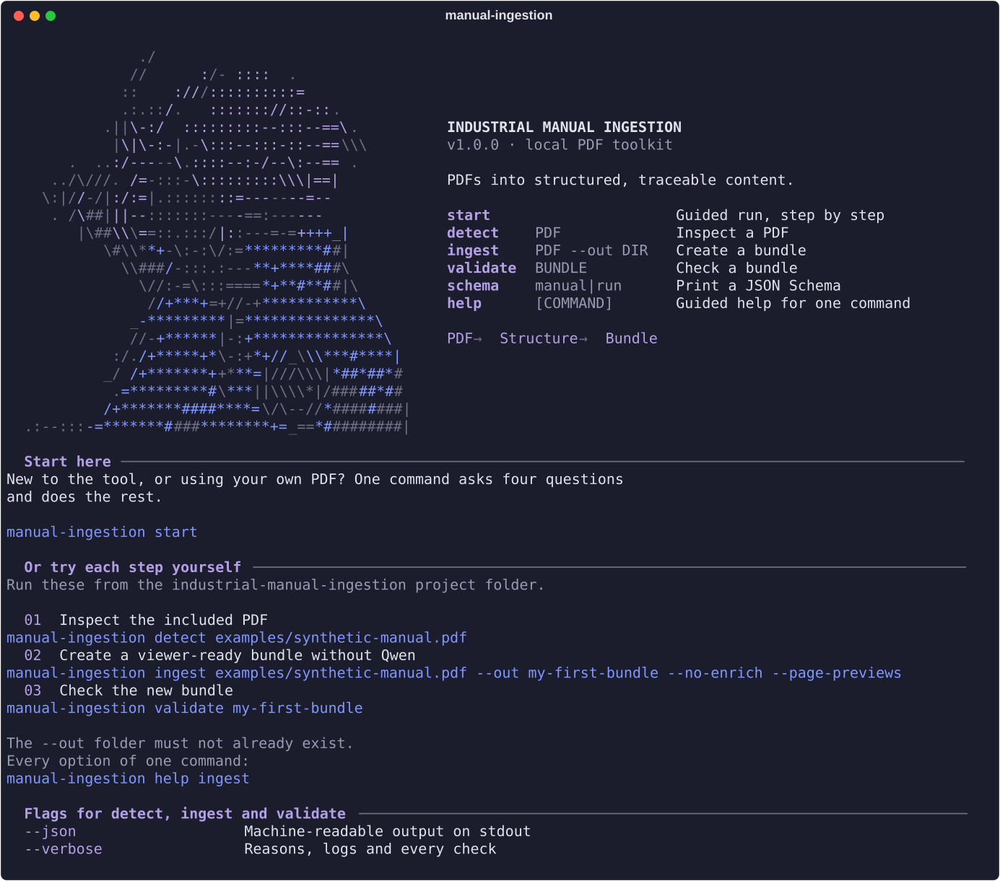
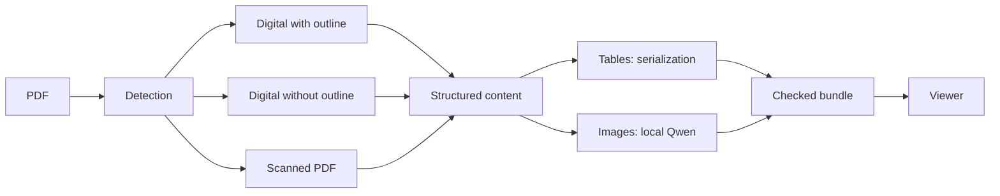

# Industrial Manual Ingestion

Turn technical PDFs into structured, traceable content with local image descriptions.

**[Open the viewer](https://CometaSensitiva.github.io/industrial-manual-ingestion/)** · [Bundle format](docs/bundle-format.md)


One Python CLI processes the document. A read-only browser viewer connects each extracted record to its original page and image. Tables use structured serialization; images receive descriptions from a local Qwen model. No chat service or retrieval system is included.

## Quick start

Requires **Python 3.12**. From a terminal, move into the folder where you cloned or downloaded the project. If you followed the suggested folder name, the command is:

```sh
cd /path/to/industrial-manual-ingestion
```

Replace `/path/to` with the actual parent folder. On macOS, you can type `cd ` and drag the `industrial-manual-ingestion` folder into the terminal to insert its exact path.

For the first setup, create the environment and install the CLI with the digital PDF parser:

```sh
python3.12 -m venv .venv
source .venv/bin/activate
pip install '.[docling]'
```

On later sessions, enter the project directory, activate the existing environment and open the home screen:

```sh
cd /path/to/industrial-manual-ingestion
source .venv/bin/activate
manual-ingestion
```



The quickest way to process your own PDF is `manual-ingestion start`, which asks four questions and runs everything (see [CLI](#cli)). The home screen also lists every command and complete examples to copy. To try the included public example step by step:

```sh
manual-ingestion detect examples/synthetic-manual.pdf
manual-ingestion ingest examples/synthetic-manual.pdf --out my-first-bundle --no-enrich --page-previews
manual-ingestion validate my-first-bundle
manual-ingestion validate examples/synthetic-bundle
```

The first bundle is intentionally created without Qwen so you can test the complete flow immediately. Its status is therefore `experimental`. The output folder must not already exist.

For image enrichment, run **Ollama** (any release; it updates itself) with **qwen3.5:4b**. The model digest, prompt version and output parameters are fixed for reproducible output; the exact Ollama version is recorded in every bundle for traceability.

```sh
ollama pull qwen3.5:4b
manual-ingestion ingest examples/synthetic-manual.pdf --out runs/my-manual --page-previews
```

First-time parsing downloads Docling model weights. Enrichment runs locally. Installation and model downloads require network access; documents are sent only to the configured Ollama endpoint (localhost by default).

## CLI

The simplest way in is the guided run. It asks four questions (the PDF, where to save the bundle, whether to describe images, whether to add page previews), accepts a dragged-in path, suggests a free folder name, checks that Ollama and the model are ready, and shows the equivalent command before starting:

```sh
manual-ingestion start
```

The same work, as direct commands:

```sh
manual-ingestion detect manual.pdf
manual-ingestion ingest manual.pdf --out runs/manual --language en --page-previews
manual-ingestion validate runs/manual
manual-ingestion detect manual.pdf --json
manual-ingestion validate runs/manual --verbose
manual-ingestion schema manual
```

The interface and help are in English. `--language` records the document language; the preserved technical-caption prompt currently requests Italian fields, so Qwen descriptions may be in Italian.

- **Finding your way:** `manual-ingestion` on its own (or `--help`) opens the home screen with every command. `manual-ingestion help ingest` opens the guided help for one command, and a mistyped command suggests the closest match.
- **After each command:** human-readable results end with a **Next** section containing the follow-up commands, already filled in with your paths.
- **When something goes wrong:** common mistakes (missing file, wrong file type, existing output folder, a folder that is not a bundle, Ollama not running or model missing) explain what to try instead.
- **Look and feel:** output shares the viewer's identity: a two-tone ASCII portrait (lavender for identity, cobalt for commands and paths), one divider style, `[ok]`/`[!]`/`[!!]` status tokens and a result tree. The portrait is omitted below 100 columns and in redirected output.
- **Typing effect:** in an interactive terminal the home screen types itself with a variable, human rhythm (a few seconds). Press any key to show it at once, or set `MANUAL_INGESTION_NO_ANIMATION=1` to disable it. Pipes, CI and `--json` are never animated.
- **Scripts:** `--json` (on `detect`, `ingest`, `validate`) gives undecorated machine-readable stdout, and errors stay plain `manual-ingestion: error: …` lines on stderr. Progress and library logs go to stderr. `--verbose` enables additional details.

`--page-previews` adds full-page PNGs for the viewer. `--pages 1-3,5` processes a diagnostic subset. `--no-enrich` skips image descriptions. The latter two produce an experimental bundle. The destination must not already exist. `--write-failure-report` saves a report beside the destination on failure.

Scanned PDFs use an isolated PaddleOCR-VL runtime, configured with `--paddle-python` and `--paddle-cache`. See [runtime details](docs/bundle-format.md#scanned-documents). Scanned output remains experimental by default: this release does not claim general acceptance from a private document study.

## Viewer

The public viewer opens a synthetic example automatically. Use **Open bundle** to choose a local folder or enter an HTTP(S) URL. Local folders are read in the browser and are not uploaded. A remote server must allow cross-origin reads.

- **Overview:** a visual journey through the source PDF, extracted structure and image descriptions, with real bundle previews, route explanations and warnings. A terminal card shows the exact `manual-ingestion ingest` command that reproduces the run. Runs without enrichment are shown explicitly.
- **Inspect:** collapsible document hierarchy, source page, labeled bounding boxes and extracted content. Images, tables, text and titles use the restrained accent palette inherited from the original research viewer.
- **Validation:** reported check status, expandable diagnostics and warnings, and direct links to each bundle file. Software checks and semantic review remain separate.

The **Source evidence** panel shows fields attached to the selected element, not a reconstruction of an external retrieval system. Add `--page-previews` during ingestion to inspect complete source pages and bounding boxes. Without it, available crops and extracted content remain inspectable.

Run locally with Node 22 or later:

```sh
cd viewer
npm ci
npm run dev
```

## How it works



## Example and limits

`examples/synthetic-manual.pdf` is an invented two-page equipment manual. The example bundle is generated by the real pipeline, including Qwen inference; it is an illustration, not a benchmark or operating instruction. Its reproduction script is `examples/build_example.py`.

Software validation checks format, provenance and consistency. It does **not** certify semantic correctness. Generated descriptions can miss details or introduce errors. A long caption produces an advisory warning rather than losing the bundle. Routing confidence is a heuristic and is not presented as a measured probability.

The viewer supports bundle schema 1.1. It checks the loaded contract but does not repeat the complete Python validation. The backend supports fixed parser/model setups; it is not a universal model-selection framework.

## Development

```sh
pip install '.[dev,docling]'
pytest
cd viewer
npm ci
npm test
npm run build
```

CI runs the Python suite, builds a wheel, and tests/builds the viewer. GitHub Pages serves only the viewer and synthetic example. Runtime documents, caches and model files are not committed.

## License

Original project code and synthetic example: [MIT](LICENSE). Dependencies retain their own licenses; consult them when redistributing or embedding the complete stack, including PyMuPDF.
